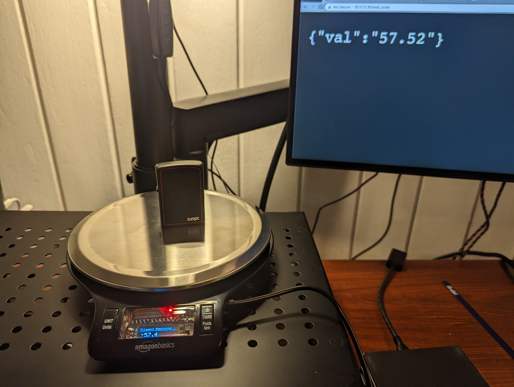
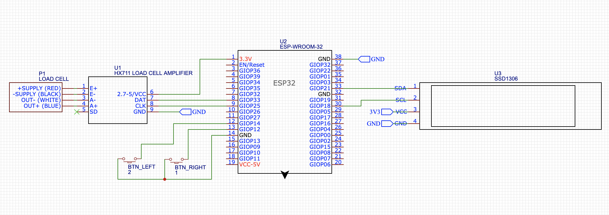
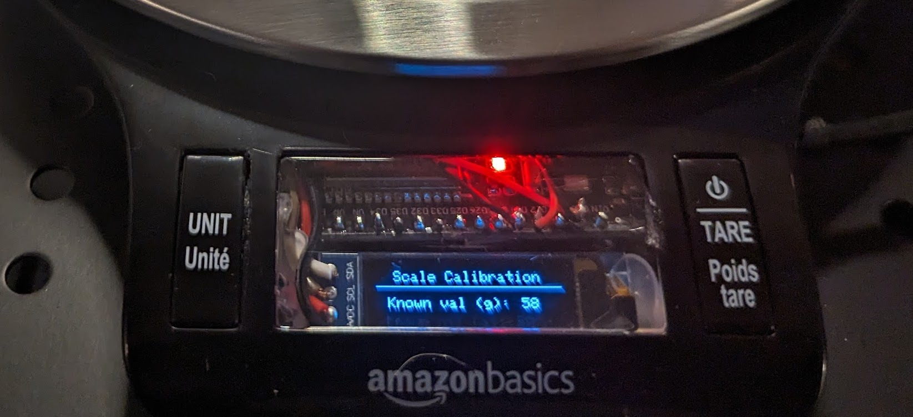

# ESP32 WiFi Kitchen Scale

Over the years I've seen a few posts on Reddit demonstrating the use of a load cell with an internet-connected microcontroller as a weight-based filament sensor for 3D printing. I decided to embark upon a similar project, retrofitting a $10 kitchen scale.

See full writeup and project guide [here](https://liore.com/arduino-esp32-load-cell-kitchen-scale-home-assistant/).

## What do we need for the retrofit?

### Hardware modules

* ESP32 or similar microcontroller with WiFi connectivity - for our purposes we'll be writing the code in C++ with the Arduino IDE.
* HX711 load cell amplifier - this module is going to allow us to get a stable, accurate reading from the load cell.
* SSD1306 i2c OLED screen (128x32)

### Libraries
* `HX711` by bogde
* `Adafruit_SSD1306` by Adafruit
* `ezButton` by ArduinoGetStarted
We'll assume that you have the EEPROM, WiFi, and WebServer libraries that are a part of the ESP32 core.*

## Smart scale schematic

## Calibration

* Press the left (UNIT) and right (TARE) buttons at the same time to enter calibration mode
* Place an item of a known weight onto the scale
* Use the left(-)/right(+) buttons to set the calibration value. Double pressing a button will move the number by 10.
* When the correct value in grams is displayed, press the two buttons at the same time once again to set the calibration value.
* Remove the item from the scale and press tare to zero out the scale, if necessary.

